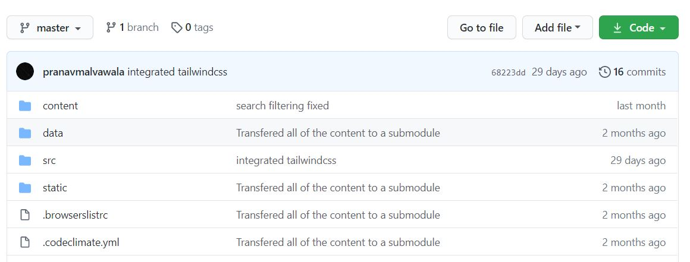
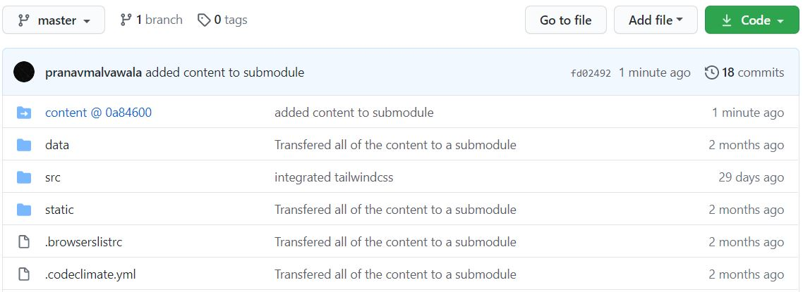

My first encounter with restricting a folder on github is when I tried to clone [Tania Rascia's](https://www.taniarascia.com/) website. Her website is amazing, filled with lots of articles and I being a curious one, wanted to take a look under the hood and after cloning the code I realized that somehow the files inside the content folder isn't downloaded.

So I went to github, looked at the repo and clicked on content folder, I got a 404 error and that's how I came to know about submodules

The whole thing here is my thought process on how I implemented the same thing i.e. privatizing the content folder. If you would like, she has also wrote an article about this and you can read it [here](https://www.taniarascia.com/git-submodules-private-content/).

## Getting Started

Restricting some of the folders in your github repository isn't something **Github** has provided us with. It does not have an inbuilt feature that we can just use it, we can either make the repo private or we can keep it all open.

But there is trick to it and our main ingredient is going to be **Git submodules**.

> _TL;DR: The folder that we want to restrict, is going to be converted into a whole new repository and then we are only going to be referencing that repo as a submodule to our main repository_

From here on out I'll be calling main repository as a **parent** repo and the files that we decided to put in a different repo will be called as **child** repo.

## Replacing a folder with submodule

Now consider you have a repo like this:



And you want to restrict **content** folder for some reason while keeping the repo functional.

The first thing to do now is create a new repository and move all the files of <i>content</i> folder into
that repo.

Now I want to see a 404 error when someone tries to access content folder so keeping that in mind I will make my new repo a private one but you can chose any, depending on your needs.

Once you move all files of <i>content</i> folder, delete the folder from the parent
repo and make a commit. So now the parent must be looking like this:


Now lets add child repo as a submodule to our parent repo. Type this cmd in parent's shell,

```bash
git submodule add <CHILD_REPO_GITHUB_URL> <PATH>
```

Here is what I would replace the variables with,  
`CHILD_REPO_GITHUB_URL` - https://github.com/pranavmalvawala/pranavmalvawala.com-content.git  
`PATH` - content/

> _If you do not mention the path, Git by default will consider repo name as the folder name and just so like me if you do not want that name just consider adding a path._

If the command was successfully executed two things would have happened:

1. You'll see a that new folder (_content_ in my case) is created which holds all files of child repo
2. A `.gitmodules` file is created which contains all the references to submodules in your project,

My `.gitmodules` file looks like this:

```terminal
[submodule "content"]
	path = content
	url = https://github.com/pranavmalvawala/pranavmalvawala.com-content.git
```

You can have as many submodules as you like and when you add a new module a new reference will be added to this file.

Let us check changes now, so I do,

```bash
git status
```

The result may look something like this

```terminal
On branch master
Your branch is up to date with 'origin/master'.

Changes to be committed:
  (use "git restore --staged <file>..." to unstage)
        new file:   .gitmodules
        new file:   content
```

Now lets commit this changes and push to github. The repo must be looking like this now,



We have successfully added _content_ folder as a submodule to the project.
You can tell that it is a submodule as it has `@ <hash>` besides the name.

> _The `<hash>` that we see here, is the commit that we are pointing to, of child repo._

## Updating a submodule

Now updating a submodule can be a bit different. We dont directly edit them from the parent repo
instead what we do is , make commits to child repo separately and then all we have to do in parent repo
is pull those changes in with `update` command.

Execute this command in parent's shell:

```bash
git submodule update --remote
```

Since we are pulling changes from remote repo, hence the `--remote` flag.

Now if the pull was sucessfully and you run `git status`, you will see something like this:

```terminal
Changes not staged for commit:
  (use "git add <file>..." to update what will be committed)
  (use "git restore <file>..." to discard changes in working directory)
	modified:   content (new commits)
```

So all you have to do now is commit this change to parent repo .The `<hash>` pointer will change and it will be pointing to the latest commit of child repo. Just do a `git push` and you will be able to verify those changes visually by checking hash commit of child repo and of the submodule in parent repo.

## Cloning a repo with submodules

If you already have a repo which has submodules in it and you are looking to clone it then,
all you have to do is clone the repo and fetch submodule in it with this:

```bash
git clone <REPO_URL>
cd <REPO_FOLDER> && git submodule init && git submodule update
```

## Deploying repository on netlify

Now if you are deploying the site using netlify and your repo has a private submodule in it.
Then you will have to follow steps below otherwise the build will fail cause netlify will not be able to clone the private module.

To resolve this netlify has given a way:

1. Generate deploy keys, you can read on how to do that [here](https://docs.netlify.com/configure-builds/repo-permissions-linking/#deploy-keys)
2. Second, make sure that url is in `git@github.com` fomat in .gitmodules file
3. Lastly go into child's repo setting > Deploy keys and click on add new key button and add the deploy keys that you generated in the first step, there.

The site will be successfully deployed.

## Summary

- Submodules allow you to keep a Git repository as a subdirectory of another Git repository.
- You can add a submodule with this command

  ```bash
  git submodule add <SUBMODULE_REPO_PATH>
  ```

- Never work on a submodule from a parent repo. You should always just pull in changes to update it.
- You can update submodule in a project with `git submodule update --remote`, where `--remote` flag implies fetch from remote url.
